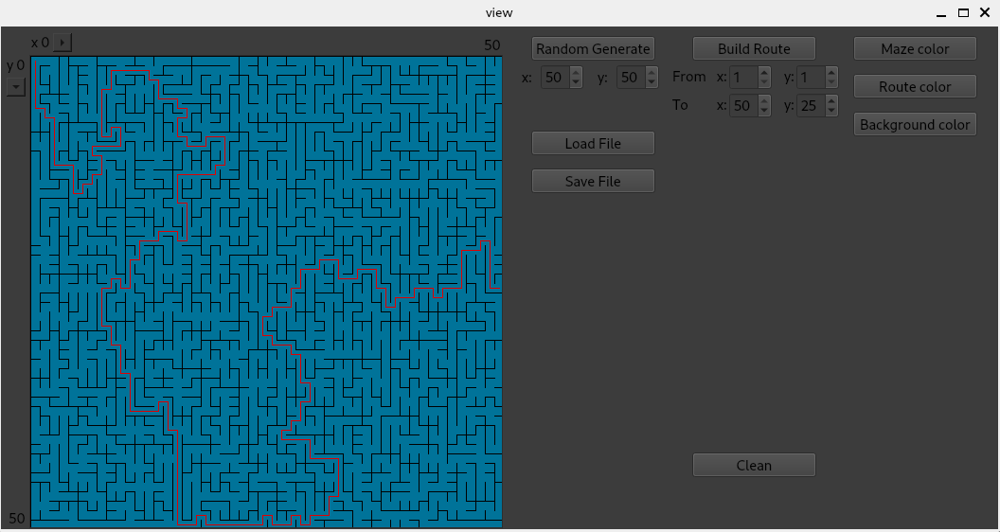

## Maze
### Made by Julieanb
## 15.10.2023

- This is the educational project "Maze". Written in C++ using MVC in QT.

- The program allows you to generate random mazes.

- To generate maze, the Eller algorithm is used.

- Maze can have sizes from 1x1 to 50x50.

- The program can plot a route from a given starting and ending point.

- A wave algorithm is used to find the path.

## Makefile targets

- all: Collects model tests and checks coverage.

- test: Gathers only model tests using gtest.

- gcov_report: Collects model coverage tests. You need gcov/lcov to work.

- install: Installs the application and generates an executable file in the build folder.

- dvi: Generates project technical documentation using doxygen. 
The documentation is initially in the repository, 
you can view it by opening src/documentation/html/index.html.

- dist: Executes the Makefile install target, then archives the executable.

- clean: Removes files generated after the test and gcov_report targets.

## Examples

### --I--

Generating random maze 10x10.

### --II--

Generating random maze 10x10. Search for a route using specified coordinates.

### --III--

The program allows you to select maze colors.

### --IV--

Files with a labyrinth have the following format - first comes the dimension of the labyrinth, 
then the matrix of right boundaries, then the matrix of lower boundaries.